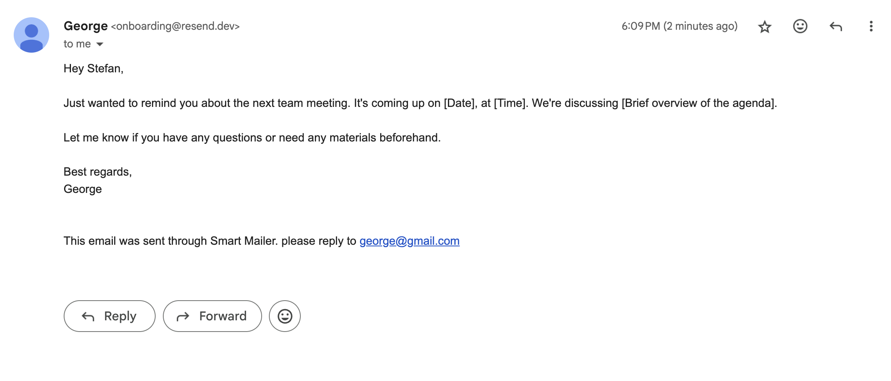

# *Smart Mailer*

**Smart Mailer** is an AI-powered email composer designed to simplify professional email writing for everyone. Whether you're using your personal Gmail account through OAuth2 or (soon) a third-party SMTP provider, Smart Mailer helps you craft clear, effective email templates in seconds.  
Simply describe what you want to say, and the AI will generate a high-quality draft that you can edit—or refine further with follow-up prompts for a more tailored message.  
Smart Mailer also supports attachments for almost any file type, making it easy to send complete, professional emails without hassle.

---
### 🚀 LIVE DEMO

👉 **Try Smart Mailer now:**  
🔗 **https://smart-mailer-fe-production.up.railway.app/**
---

## 🎥 Demo

### See It in Action

### Example Output

Here's what the final email looks like:

## Third Party SMPT Integration (WIP)

Smart Mailer supports the option to avoid giving sensitive permissions, such as email sending to the server. Instead, users can choose 'Third Party' at the top section of the screen, to use the Resend API to send emails from an external domain, instead of their own gmail account. 

This is what the third party email looks like.

---
# *How it's Made*

## 🛠️ Tech Stack

- **Frontend:** React  
- **Backend:** Node.js, Express  
- Full-stack architecture with separate client and server repositories.

## Backend Overview
The backend mainly handles 3 responsibilities:
### 1. Authorization

Secure Gmail integration using **OAuth 2.0**:

- Users sign in with Google OAuth to grant email-sending permissions.
- A **refresh token** is securely stored to keep users signed in between sessions.
- The backend handles token refreshes and session security.

---

### 2. Text Generation

- Uses Open AI API to create responses
- Generates full email drafts from simple prompts.
- Supports **follow-up prompts** for iterative editing.
- Uses **Chat history** so that the model knows everything relevent to the prompt

---

### 3. Email Sending Logic

- Composes emails with subject, body, recipients, and attachments.
- Supports **attachments of almost any file type**.
- Sends email via the **Gmail API**.  
- *(Coming soon)*: Support for third-party SMTP providers like **Mailgun** and **Resend**.

---

## 🖥️ Frontend Overview
- The frontend repo can be found [here](https://github.com/hobbbbies/smart-mailer-FE)

### 1. Main Page

- Utilizes React Library/Framework for responsive, pleasent UI
- User is presented with inputs for email data, as well as an option for attachments
- On submission of the form, user is shown a popup screen that provides an overview of what is to be sent

### 2. Popup
- The popup form is a chance for the user to review what has been composed. It shows the sender/receiver address, the email body, and any attachments.
- User can either manually edit body, or send a **follow up** query prompt to the backend, outling what they would like to be changed.
- Once the user is happy, they can press the send button, and *voila*

---
# *How to Install*
1. - Clone this repo
   - npm install
   - node app.js
2. - Clone the [frontend repo](https://github.com/hobbbbies/smart-mailer-FE)
   - npm install
   - npm run build
   - npm run dev
   
Backend **env variables:** 
- `FRONTEND_URL`: URL of the deployed frontend (e.g., https://smart-mailer-fe-production.up.railway.app)

- `NODE_ENV`: Environment type (e.g., "production" or "development")

- `OPENAI_API_KEY`: API key for accessing OpenAI's models *ollama locally hosted models work instead, if NODE_ENV is set to 'development'

- `OAUTH_CLIENT_ID`: Google OAuth client ID for Gmail API integration * **Need to make a google cloud project to obtain** *

- `OAUTH_CLIENT_SECRET`: Google OAuth client secret - * **Need to make a google cloud project to obtain** *

- `OAUTH_REDIRECT_LOCAL`: Redirect URI for Google OAuth (used after login) * **Need to make a google cloud project to obtain** *
  
- `DATABASE_URL`: PostgreSQL database connection string (used by Prisma)

- `PORT`: The port the backend server runs on (e.g., 8080)

- `Mailgun section (NOT FULLY IMPLEMENTED)`
  This section isn't fully up and running right now, but you may need placeholders for these variables at the very least
  - `MAILGUN_API_KEY`: Mailgun API key for sending emails via SMTP (used for third-party sending)
  
  - `EMAIL_USER`: Mailgun "from" address (used as sender)
  
  - `EMAIL_PASS`: SMTP password for the Mailgun user
  
  - `EMAIL_HOST`: SMTP server host (e.g., smtp.mailgun.org)
  
  - `EMAIL_PORT`: Port used for SMTP (e.g., 587)
  - (Probably skip this one)`RESEND_API_KEY`: API key for Resend (alternative SMTP provider)

Frontend **env variables:**

- `PORT`: (Not needed for localhost) The port the frontend development server runs on (e.g., `5173`).  
  This is used when running the app locally with `npm run dev`.

- `VITE_API_URL`: The base URL of the backend server (e.g., `https://smart-mailer-production.up.railway.app`).  
  This tells the frontend where to send API requests during development and production.
---

# *Lessons learned*

Building Smart Mailer was not just a technical project—it was a learning experience that clarified some key habits and principles I’ll carry into future development work:

### 🧠 1. Plan Before You Build

At first, I underestimated how much planning even small features needed. I often dove in thinking I'd "figure it out as I go," but that usually led to rewriting logic or redoing UI components. Taking a few minutes to sketch out what needs to be done—what goes where, what data is needed—would’ve saved me a lot of time and frustration.

### 🔍 2. Research Before You Code

The OAuth integration taught me this the hard way. I started implementing it with only a surface-level understanding, and ran into issues with scopes, consent screens, and token persistence. If I had read through Google's documentation more thoroughly before coding, I would have avoided hours of trial-and-error. Since then, I’ve learned to research a tool or API *before* trying to integrate it.

### 💾 3. Commit Frequently

Early on, I lost a working version of my app after experimenting with a few new changes that broke things—and I had no clean commit to revert to. That moment made me realize the value of committing more often, even for minor changes. Frequent commits provide a safety net and make debugging much easier.

