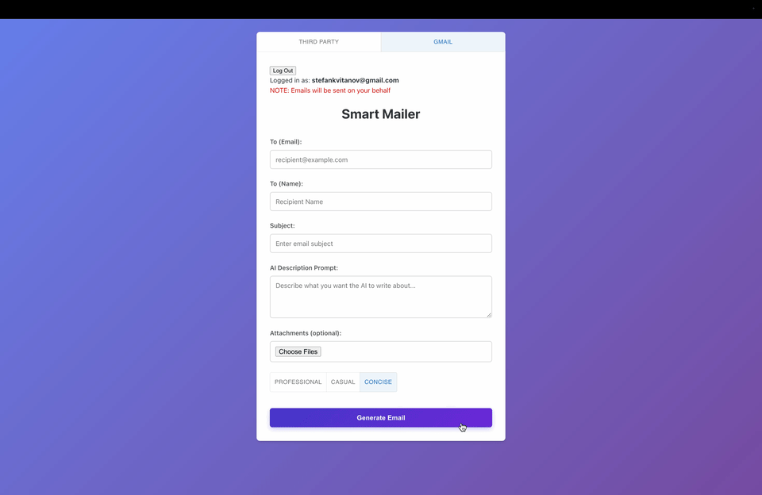
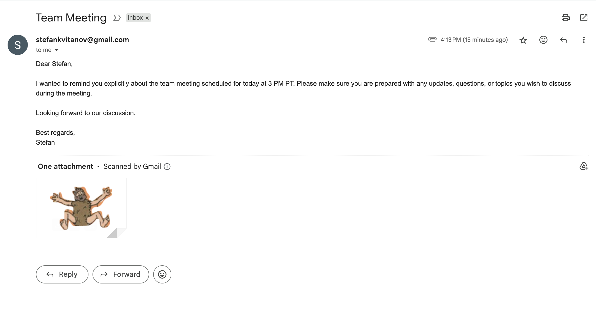

# Smart Mailer 📩

**Smart Mailer** is an AI-powered email composer designed to simplify professional email writing for everyone. Whether you're using your personal Gmail account or (soon) a third-party SMTP provider, Smart Mailer helps you craft clear, effective email templates in seconds.  
Simply describe what you want to say, and the AI will generate a high-quality draft that you can edit—or refine further with follow-up prompts for a more tailored message.  
Smart Mailer also supports attachments for almost any file type, making it easy to send complete, professional emails without hassle.

🔗 **Live demo:** [Smart Mailer App](https://smart-mailer-fe-production.up.railway.app/)

---

## 🎥 Demo

### See It in Action

### Example Output

Here's what the final email looks like:

---
# How it's Made

## 🛠️ Tech Stack

- **Frontend:** React  
- **Backend:** Node.js, Express  
- Full-stack architecture with separate client and server repositories.

## Backend Overview

### 🔐 1. Authorization

Secure Gmail integration using **OAuth 2.0**:

- Users sign in with Google OAuth to grant email-sending permissions.
- A **refresh token** is securely stored to keep users signed in between sessions.
- The backend handles token refreshes and session security.

---

### 🤖 2. Text Generation

- Uses Open AI API to create responses
- Generates full email drafts from simple prompts.
- Supports **follow-up prompts** for iterative editing.
- Uses **Chat history**so that the model knows everything relevent to the prompt

---

### 📤 3. Email Sending Logic

- Composes emails with subject, body, recipients, and attachments.
- Supports **attachments of almost any file type**.
- Sends email via the **Gmail API**.  
- *(Coming soon)*: Support for third-party SMTP providers like **Mailgun** and **Resend**.

---
